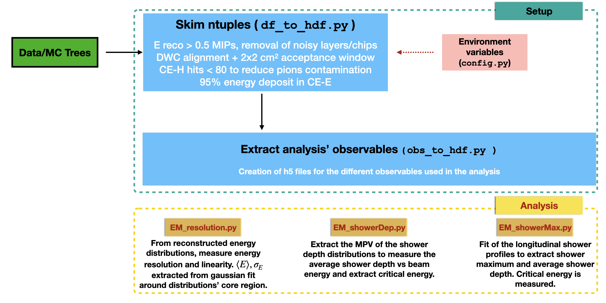

# HGCALStandaloneAnalysis
Standalone framework for the analysis of the electromagnetic compartment (CE-E) 
of the HGCAL prototype used in 2018 TB.

## Workflow
The first part of the analysis workflow consist of a skimming of the data and 
simulation ntuples, in order to cache them for the consequent steps of the analysis.
The building blocks of this are stored in the `setup` directory.
Starting from the recontstructed ntuples, the framework creates `h5` files for
each beam energy. These files contain the full statistics available, after the
application of the preselection and cleaning cuts used in the analysis. This 
first step is handled by the `df_to_hdf.py` script.

In the next step we create `h5` files for each energy, for the three main observables
used in this analysis. Namely:
 * Reconstructed energy per event;
 * Average shower depth (COG z);
 * Longitudinal profiles.

This is done with the `obs_to_hdf.py` script. For the reconstructed energy and
the longitudinal profiles is possible to apply the dEdx calibration, using the
`dEdx` bool flag of the methods defined in `hdf_helpers.py`.

## Analysis
Once the datasets are created, they can be used for the different steps of the
analysis in a faster way, without having to reprocess all the ntuples every time.
The building blocks of the analysis are stored in the `analysis` directory.
There is one script for each section of the data analysis:
 * `EM_resolution.py` : computes the CE-E energy resolution starting from the 
 reconstructed energy distributions;
 * `EM_showerDepth.py` : computes the average shower depth (COZ z) starting from
 the COG z distributions;
 * `EM_showerMax.py` : computes the shower maximum and the average shower depth
 from the fit of the longitudinal profiles.

### Control plots
In the directory `controlPlots` there are few scripts to produce the usual control
plots of the analysis. Namely, the reconstructed energy distributions, the shower
depth distributions and the longitudinal shower profiles.

